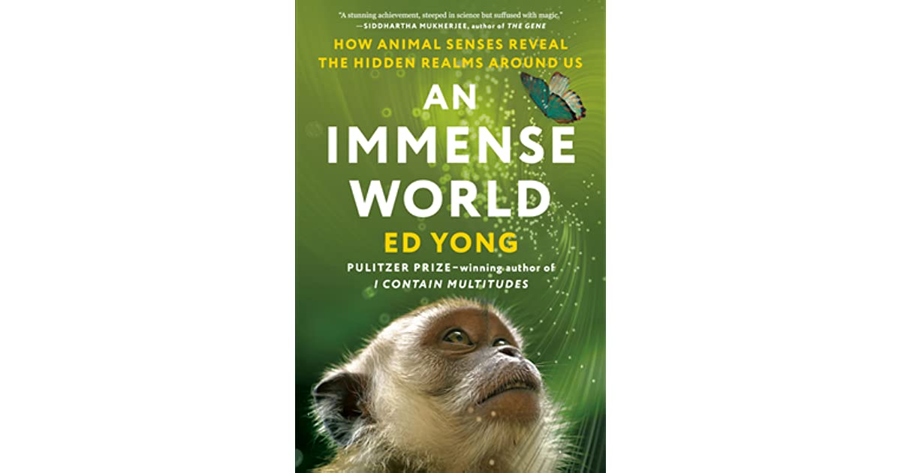
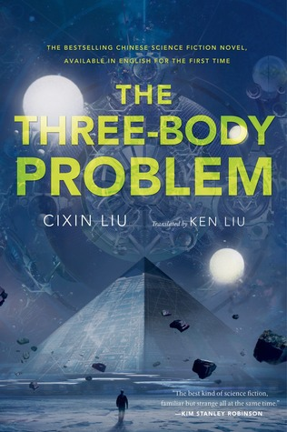
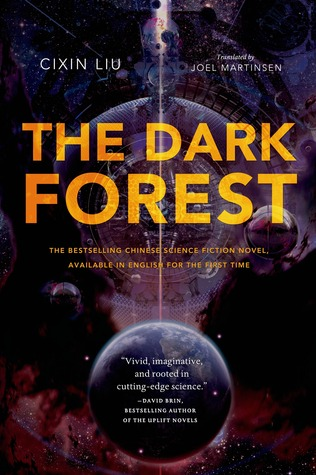

<!-- cover:
    image: "<image path/url>" # image path/url
    alt: "<alt text>" # alt text
    caption: "<text>" # display caption under cover
    relative: false # when using page bundles set this to true
    hidden: true # only hide on current single page -->
<!-- editPost:
    URL: "https://github.com/<path_to_repo>/content"
    Text: "Suggest Changes" # edit text
    appendFilePath: true # to append file path to Edit link -->

Currently Reading: An Immense World by Ed Yong


  


Favorite Read of the year: The Three Body Problem Series



  
   


