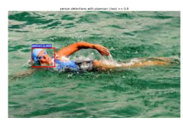
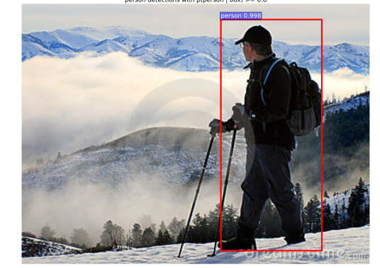
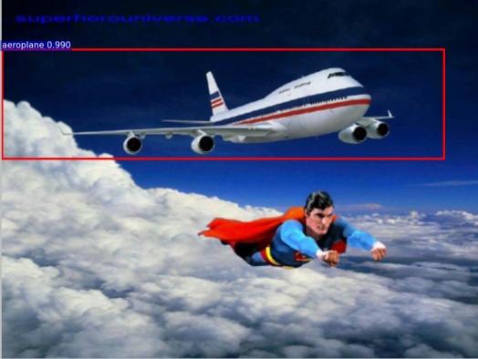
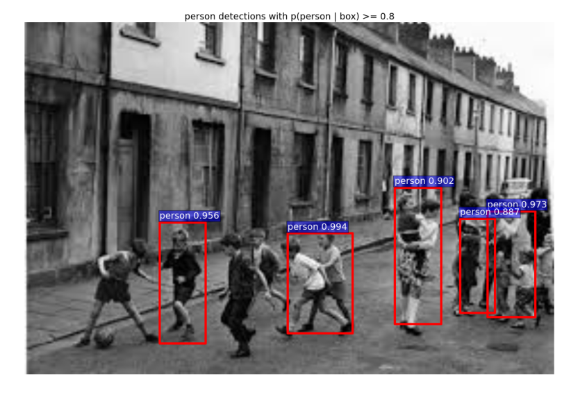
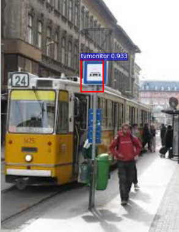
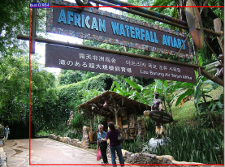
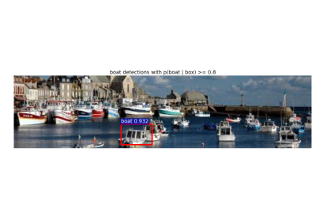

I was playing around with [this](https://github.com/rbgirshick/py-faster-rcnn) implementation of RCNN released in 2015 by Ross Girshik. This method is described in detail in his Faster-RCNN paper resleased in NIPS 2015. (I was *there* and this groundbreaking unfurling of CNN+RCNN was happening around me which gives me all the more reason to be super excited!). I used the pre-trained VGG 16 net where VGG stands for Virtual Geometry Group and 16 because the network is 16-layered. The image is passed through a stack of convolutional layers which use a 3×3 filter followed by 3 fully connected layers. The convolutional stride is fixed at 1 pixel.

They train these architectures on ILSVRC-2012 dataset which consists of 1000 classes with approximately 1.5 million images. Coming back to RCNN, using the pre-trained VGG-16 network, I fine-tuned the network on PASCAL VOC detection data (20 object classes, and 1 background class).

```
CLASSES = (‘__background__’,
‘aeroplane’, ‘bicycle’, ‘bird’, ‘boat’,
‘bottle’, ‘bus’, ‘car’, ‘cat’, ‘chair’,
‘cow’, ‘diningtable’, ‘dog’, ‘horse’,
‘motorbike’, ‘person’, ‘pottedplant’,
‘sheep’, ‘sofa’, ‘train’, ‘tvmonitor’)
```

The idea therefore is to take a pre-trained network and fine-tune it to improve the parameter accuracy. During fine-tuning, region proposals are extracted from these images that are fed to the network and are warped to fit the input size of the network. Now, initially, during the training on the ILSVRC dataset- the a 1000 way classification layer was used which is replaced by a randomly initialized 21-way classification layer (for the 20 VOC classes mentioned above plus background). The rest of the CNN architecture remains unchanged. We continue our SGD training of CNN parameters and filter the region proposals based on their Intersection over Union (IoU) value.

At test time, when we feed images into the network, RCNN uses [Selective Search](http://koen.me/research/selectivesearch/) to extract ~300 boxes that likely contain objects and evaluates the ConvNet on each one of them, followed by non-maximum suppression within each class. This usually takes on order of 20 seconds per image running it on my normal computer in CPU-Only mode. RCNN uses [Caffe](http://caffe.berkeleyvision.org/index.html) (a very nice C++ ConvNet library) to train the ConvNet models, and both are available under BSD on Github.

Below are some example results of running RCNN on some random images. The number next to the bounding box is the caffe’s confidence on whether the image inside the bounding box belongs to a certain class. Keep in mind that the threshold value can be changed in the code and has been kept as >=0.8 (and NMS threshold >=0.3) for most images shown below. So only the high-confidence classifications will be shown below.

 

Sometimes it mistakes a bus for a train but they do look quite similar!


Next, let's look at its ability to detect people in different settings:
  

Whether you're swimming..



or hiking.. 


or mountaineering..

  

or flying..!


It is really good at detecting people.



In most images, it does pretty well. (It even manages to capture Superman — not as a plane, nor a bird, but as a person). However, it goes terribly wrong once in a while– for example, it identifies the African Waterfall Aviary as a BUS! And with a confidence of 0.954. In images with low quality, it can get slightly confused for example– the image with a number of boats gives very poor object detection results while in some cases, it gets confused– like the street sign being identified as a TV Monitor.[^1]

<!--  -->





[^1]: Images could not be loaded after blog theme migration. Apologies!
